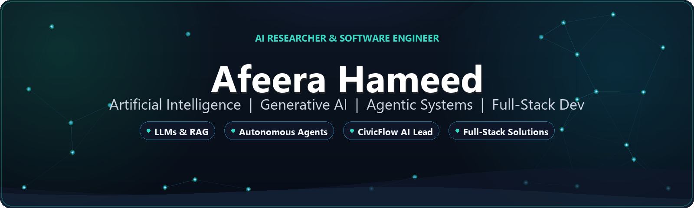

<div align="center">

  <!-- Premium AI Banner -->
  

  <br/><br/>

  <!-- Dynamic Typing Animation -->
  <a href="https://github.com/Paradise786">
    
  </a>

  <br/>

  <!-- Live Profile Badges -->
  <p align="center">
    <a href="https://github.com/Paradise786?tab=followers">
      
    </a>
    <a href="https://github.com/Paradise786">
      
    </a>
    
  </p>

</div>

---

### 💫 About Me

```yaml
name: Afeera Hameed
role: AI & Generative AI Engineer | Full-Stack Developer
focus: Agentic AI, Large Language Models (LLMs), RAG Pipelines
flagship_project: CivicFlow AI (Smart Citizen Issue Reporting Platform)
quote: "Building autonomous systems and intelligent software that empower real-world communities."
```

* 🧠 **Specialization:** Generative AI, Retrieval-Augmented Generation (RAG), and Multi-Agent Reasoning Loops.
* 🏛️ **Flagship Initiative:** Leading design & development for **CivicFlow AI** — an AI-powered smart triage & citizen management platform.
* 🔬 **Current Research:** Autonomous Agent Workflows, Prompt Optimization, LLM Finetuning & Tool-Use.
* 💻 **Engineering Stack:** Python, Machine Learning frameworks, PHP, MySQL, and modern web architectures.

---

### 🏆 GitHub Trophies

<p align="center">
  
</p>

---

### 🏛️ Featured Projects

<table>
  <tr>
    <td width="50%">
      <h3 align="center">🚀 CivicFlow AI</h3>
      <p align="center">
        <b>AI-Powered Smart Citizen Issue Reporting & Management System</b>
      </p>
      <ul>
        <li><b>Smart Triage:</b> Automated categorization & priority indexing with NLP models.</li>
        <li><b>Geolocation Tagging:</b> High-precision geotagged reporting for rapid civic response.</li>
        <li><b>Admin Command Hub:</b> Real-time issue lifecycle analytics & tracking.</li>
      </ul>
      <p align="center">
        
        
      </p>
    </td>
    <td width="50%">
      <h3 align="center">🤖 Agentic AI Projects</h3>
      <p align="center">
        <b>Autonomous Multi-Agent Systems & LLM Integrations</b>
      </p>
      <ul>
        <li><b>Agent Orchestration:</b> Multi-step planning, tool-calling, and reasoning chains.</li>
        <li><b>RAG Implementation:</b> Vector search & semantic retrieval systems.</li>
        <li><b>Interactive Demos:</b> AI-augmented productivity & automation workflows.</li>
      </ul>
      <p align="center">
        <a href="https://github.com/Paradise786/Agentic-AI-Projects">
          
        </a>
      </p>
    </td>
  </tr>
  <tr>
    <td width="50%">
      <h3 align="center">✨ Generative AI Explorations</h3>
      <p align="center">
        <b>State-of-the-Art Generative Models & Experimentation</b>
      </p>
      <ul>
        <li>Hands-on implementations of modern generative vision & text pipelines.</li>
        <li>Prompt benchmarking and API integration with frontier LLM backends.</li>
      </ul>
      <p align="center">
        <a href="https://github.com/Paradise786/GenerativeAI3">
          
        </a>
      </p>
    </td>
    <td width="50%">
      <h3 align="center">💼 Full-Stack & Management Systems</h3>
      <p align="center">
        <b>Enterprise CRUD & Relational Database Applications</b>
      </p>
      <ul>
        <li>Full-featured student & resource management system.</li>
        <li>Secure authentication, optimized MySQL querying, and responsive UI.</li>
      </ul>
      <p align="center">
        <a href="https://github.com/Paradise786/decodelabsproject1">
          
        </a>
      </p>
    </td>
  </tr>
</table>

---

### 🛠️ Tech Stack & Tooling

<div align="center">

#### AI, Machine Learning & Data


#### Web, Backend & Databases


#### Developer Tools & Workflows


</div>

---

### 📊 GitHub Activity & Statistics

<p align="center">
  
  
</p>

<p align="center">
  
</p>

---

### 📬 Let's Connect & Collaborate

<p align="center">
  <a href="https://github.com/Paradise786" target="_blank">
    
  </a>
  &nbsp;&nbsp;
  <a href="https://linkedin.com/in/" target="_blank">
    
  </a>
  &nbsp;&nbsp;
  <a href="mailto:your-email@example.com" target="_blank">
    
  </a>
</p>

---

<div align="center">

💡 *"The future belongs to those who teach machines how to think and humans how to build."* 💡

<br/>

© **Afeera Hameed** • Built with passion for Artificial Intelligence & Innovation

</div>
